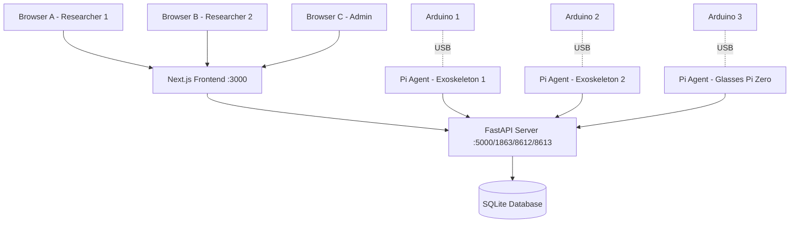
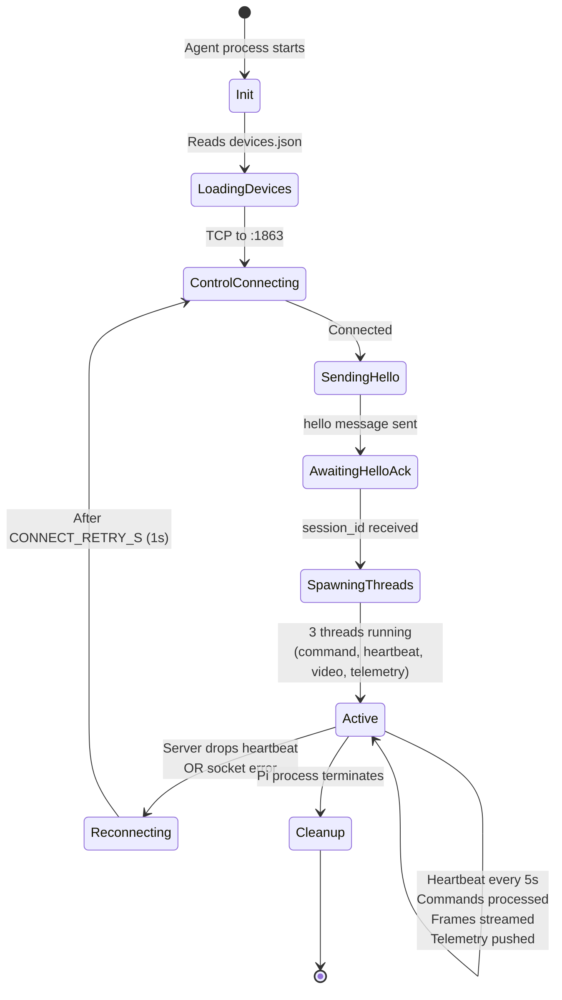
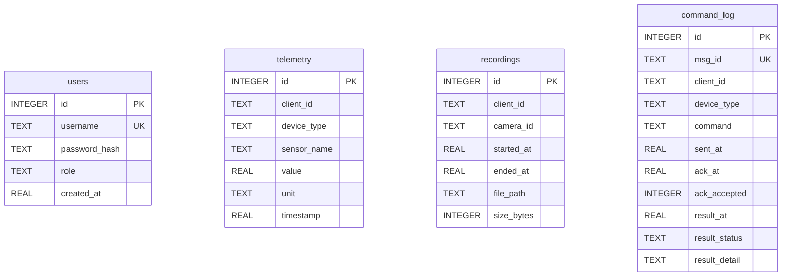
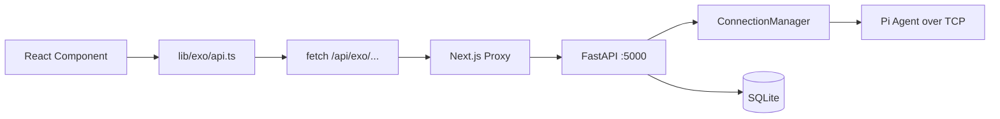

# Architecture Deep Dive

This document describes the inner workings of Exo-Platform: communication protocols, data flows, port assignments, lifecycle management, and the database schema.

If you're just trying to run the system, see the main [README](README.md). This document is for **contributors, researchers extending the platform, and operators debugging production deployments**.

---

## Table of Contents

1. [System Topology](#system-topology)
2. [Network Protocol v2](#network-protocol-v2)
3. [Port Assignments](#port-assignments)
4. [Session Lifecycle](#session-lifecycle)
5. [Command Flow](#command-flow)
6. [Video Streaming](#video-streaming)
7. [Telemetry Channel](#telemetry-channel)
8. [Database Schema](#database-schema)
9. [Device Driver Architecture](#device-driver-architecture)
10. [Frontend-to-Backend Flow](#frontend-to-backend-flow)
11. [Thread Model](#thread-model)

---

## System Topology

The system is a **star topology** centered on the FastAPI server:



**Why star topology?**
- Centralized state: one place to query "who's connected?"
- Centralized persistence: SQLite is the single source of truth
- Simpler auth: researchers authenticate once with the server
- Fleets can be operated from anywhere with network access to the server

---

## Network Protocol v2

All Pi-to-server communication uses **three TCP channels** with distinct purposes. Each channel uses a different serialization format optimized for its workload.

### Channel 1: Control (JSON Lines)

**Purpose:** Bidirectional command and control.

**Format:** UTF-8 JSON objects, one per line, newline-terminated (`\n`).

**Max message size:** 64KB (configurable via `EXO_MAX_CONTROL_LINE_BYTES`).

### Channel 2: Video (Length-Prefixed Binary)

**Purpose:** Pi → Server JPEG streaming.

**Format:** 4-byte big-endian unsigned int (frame size) followed by that many bytes of JPEG data.

**Max frame:** 4MB (configurable via `EXO_MAX_FRAME_BYTES`).

### Channel 3: Telemetry (Length-Prefixed JSON)

**Purpose:** Pi → Server sensor data.

**Format:** 4-byte big-endian unsigned int (payload size) followed by JSON payload.

**Rate:** 10Hz default (configurable via `EXO_TELEMETRY_HZ` on Pi).

---

## Port Assignments

| Port | Direction | Protocol | Payload | Purpose |
|------|-----------|----------|---------|---------|
| **3000** | Browser ↔ Server | HTTP | HTML, JS, CSS | Next.js frontend |
| **5000** | Browser ↔ Server | HTTP + WebSocket | JSON, MJPEG | FastAPI REST + WS |
| **1863** | Pi ↔ Server | TCP | JSON lines | Control channel |
| **8612** | Pi → Server | TCP | Binary (length-prefixed JPEG) | Video streaming |
| **8613** | Pi → Server | TCP | Length-prefixed JSON | Telemetry |

All ports configurable via environment variables:
- `EXO_HTTP_PORT` (5000)
- `EXO_CONTROL_PORT` (1863)
- `EXO_VIDEO_PORT` (8612)
- `EXO_TELEMETRY_PORT` (8613)

---

## Session Lifecycle

Every Pi agent session follows the same state machine:



### Detailed Handshake (Hello / Hello ACK)

**Pi → Server (hello):**
```json
{
  "version": 2,
  "type": "hello",
  "client_id": "pi-arm-01",
  "session_id": null,
  "msg_id": "a1b2c3d4e5f6...",
  "ts": 1745612345.678,
  "payload": {
    "sim_mode": false,
    "devices": [
      {"type": "motor", "id": "arm_motor", "config": {"baud": 9600}},
      {"type": "camera", "id": "main_cam", "config": {"resolution": [640, 480]}},
      {"type": "gyroscope", "id": "imu", "config": {}}
    ]
  }
}
```

**Server → Pi (hello_ack):**
```json
{
  "version": 2,
  "type": "hello_ack",
  "client_id": "pi-arm-01",
  "session_id": "9f8e7d6c5b4a...",
  "msg_id": "f1e2d3c4b5a6...",
  "ts": 1745612345.789,
  "payload": {
    "heartbeat_interval_s": 5.0
  }
}
```

The `session_id` returned by the server is used by the Pi agent for:
- All subsequent heartbeats (so server can verify identity)
- Opening the video channel (`video_hello`)
- Opening the telemetry channel (`telemetry_hello`)

### Heartbeat

Every `HEARTBEAT_INTERVAL_S` seconds (default 5), the Pi sends:

```json
{
  "version": 2,
  "type": "heartbeat",
  "client_id": "pi-arm-01",
  "session_id": "9f8e7d6c5b4a...",
  "msg_id": "...",
  "ts": 1745612350.0,
  "payload": {}
}
```

If the server doesn't receive a heartbeat for `HEARTBEAT_TIMEOUT_S` seconds (default 20), it drops the session and frees resources.

---

## Command Flow

### 1. Frontend → Server

The browser sends a POST request:

```http
POST /api/exo/clients/pi-arm-01/devices/motor/command
Content-Type: application/json

{
  "command": "step",
  "params": {"steps": 100}
}
```

Next.js proxies this to `http://localhost:5000/api/clients/pi-arm-01/devices/motor/command` via `next.config.mjs` rewrites.

### 2. Server → Pi

The server translates this to the wire format (`device:command params`) and sends over TCP:

```json
{
  "version": 2,
  "type": "command",
  "client_id": "pi-arm-01",
  "session_id": "9f8e7d6c5b4a...",
  "msg_id": "cmd-uuid-abc123",
  "ts": 1745612360.0,
  "payload": {"command": "motor:step 100"}
}
```

Server also logs the command to SQLite (`command_log` table) for history tracking.

### 3. Pi → Arduino

The Pi agent's command loop parses `motor:step 100`, dispatches to `MotorDriver.execute_command("step", "100")`, which writes to the USB serial:

```
motor_step 100\r
```

### 4. Arduino → Pi

Arduino executes the step pulses and responds via serial:

```json
{"type":"ack","cmd":"motor_step","status":"ok"}
```

### 5. Pi → Server (ack)

As soon as the Pi receives the command (before execution), it sends an ACK:

```json
{
  "version": 2,
  "type": "command_ack",
  "client_id": "pi-arm-01",
  "session_id": "9f8e7d6c5b4a...",
  "msg_id": "cmd-uuid-abc123",
  "ts": 1745612360.1,
  "payload": {"accepted": true}
}
```

### 6. Pi → Server (result)

After execution completes, the Pi sends the result:

```json
{
  "version": 2,
  "type": "command_result",
  "client_id": "pi-arm-01",
  "session_id": "9f8e7d6c5b4a...",
  "msg_id": "cmd-uuid-abc123",
  "ts": 1745612360.3,
  "payload": {"status": "ok", "detail": "step 100 executed"}
}
```

### 7. Server → Database → Frontend

The server updates the `command_log` entry with ack_at and result_status. The frontend polls `/api/clients/pi-arm-01/commands` every few seconds (or receives a WebSocket push in future versions) to show the updated state.

---

## Video Streaming

### Pi Side

1. Pi connects to `:8612` after establishing a control session
2. Sends `video_hello` registration (length-prefixed JSON with session_id for verification)
3. Loops:
   - Capture frame from Picamera2 (or generate synthetic frame in sim mode)
   - Encode to JPEG (quality 70, resolution 640x480)
   - Send: `[4-byte length][JPEG bytes]`
   - Sleep to maintain target FPS (default 15)

### Server Side

1. Accepts TCP connection on `:8612`
2. Reads `video_hello`, validates session_id matches an active session
3. Stores the `video_conn` socket in the client's session
4. Reader thread continuously:
   - Reads 4-byte length
   - Reads that many bytes
   - Stores as `_latest_frames[client_id]`

### Browser Side

`GET /api/exo/clients/pi-arm-01/video` returns a `multipart/x-mixed-replace` MJPEG stream:

```http
HTTP/1.1 200 OK
Content-Type: multipart/x-mixed-replace; boundary=frame

--frame
Content-Type: image/jpeg

<JPEG bytes>
--frame
Content-Type: image/jpeg

<JPEG bytes>
...
```

The server generator loops at `VIDEO_STREAM_FPS` (default 15) pulling from `_latest_frames[client_id]`. An `` tag in the browser automatically consumes this stream.

**Latency:** Typically 100-300ms on local network (depends on JPEG encoding + socket buffering).

---

## Telemetry Channel

### Flow

1. Pi connects to `:8613` after control session established
2. Sends `telemetry_hello` registration (same pattern as video)
3. Telemetry loop runs at `TELEMETRY_HZ` (default 10Hz):
   - For each device in `devices.json`, calls `device.read_telemetry()` which returns a dict
   - Packages all readings into a single packet
   - Sends length-prefixed JSON

### Example Telemetry Packet

```json
{
  "client_id": "pi-arm-01",
  "timestamp": 1745612365.123,
  "readings": {
    "arm_motor": {
      "step_count": 1042,
      "last_command": "step 100"
    },
    "imu": {
      "accel_x": 0.05,
      "accel_y": -0.02,
      "accel_z": 9.81,
      "gyro_x": 0.001,
      "gyro_y": 0.002,
      "gyro_z": -0.001,
      "calibrated": true
    },
    "temp1": {
      "temperature_c": 25.4,
      "target_c": null,
      "control_active": false
    },
    "tens1": {
      "active": false,
      "intensity": 0,
      "frequency_hz": 0,
      "max_intensity": 100
    }
  }
}
```

### Persistence

On every packet, the server's `on_telemetry` callback inserts rows into the `telemetry` table. One packet can produce dozens of rows (one per sensor_name).

### WebSocket Push to Browser

Browsers can subscribe to live telemetry via WebSocket:

```
ws://localhost:3000/api/exo/clients/pi-arm-01/telemetry/ws
```

The server pushes the latest packet whenever it changes (debounced to avoid spam).

---

## Database Schema

SQLite database at `server/exo_data.db` (configurable via `EXO_DATABASE_PATH`).



**Indexes:**
- `telemetry(client_id, timestamp)` — Fast time-range queries per Pi
- `command_log(client_id, sent_at)` — Command history lookup

**Why SQLite?**
- Zero setup for local dev
- Single file, easy to back up
- Good enough for <100 Pis and typical research workloads
- Trivial to migrate to PostgreSQL if you need concurrent writes at scale

---

## Device Driver Architecture

All devices inherit from `DeviceDriver` in [`pi_agent/devices/base.py`](pi_agent/devices/base.py):

```python
class DeviceDriver:
    device_type: str = "unknown"

    def __init__(self, device_id, device_config, sim_mode):
        self.device_id = device_id
        self.config = device_config
        self.sim_mode = sim_mode

    def execute_command(self, command: str, params: str) -> tuple[str, str]:
        """Execute a command. Returns (status, detail)."""
        ...

    def read_telemetry(self) -> dict | None:
        """Return current sensor readings, or None if no telemetry."""
        ...

    def get_manifest_entry(self) -> dict:
        """Return device info for the hello manifest."""
        ...
```

### Dispatcher Pattern

The agent's `_execute_command()` parses `device_id:command params`:

```python
def _execute_command(self, command_str):
    parts = command_str.split(":", 1)
    if len(parts) == 2:
        device_id, rest = parts
        device = self.devices.get(device_id)
        if device:
            cmd, _, params = rest.strip().partition(" ")
            return device.execute_command(cmd, params)
    # Legacy fallback for pre-v2 clients
    return self._execute_legacy_command(command_str)
```

### Adding a New Device

1. Create `pi_agent/devices/mydevice.py` with a class extending `DeviceDriver`
2. Register it in `pi_agent/devices/__init__.py` → `DEVICE_REGISTRY`
3. Add entry to `pi_agent/devices.json`
4. Optionally add visualization in `nanotech_website/components/exo/device-control.tsx`

See [CONTRIBUTING.md](CONTRIBUTING.md) for the full walkthrough.

---

## Frontend-to-Backend Flow



The `next.config.mjs` rewrite is critical — it makes the frontend and backend appear as one origin to the browser (avoiding CORS preflights for same-origin requests).

### Why Not Call the Server Directly?

- **Avoid CORS**: Same-origin from browser's POV
- **Hide backend URL**: Frontend doesn't need to know the server's real address
- **Future-proof**: Can add auth middleware, caching, or rate limiting at the Next.js layer

---

## Thread Model

### Server (FastAPI)

FastAPI runs on `uvicorn` with its own event loop. Additionally, the `ConnectionManager` spawns daemon threads for TCP I/O:

- 1 thread for control listener accept loop
- 1 thread per connected Pi for control reader (heartbeat, ack, result)
- 1 thread for video listener accept loop
- 1 thread per connected Pi for video reader
- 1 thread for telemetry listener accept loop
- 1 thread per connected Pi for telemetry reader
- 1 thread for heartbeat monitoring (detects stale sessions)

For 10 Pis, that's ~31 threads. Python's GIL is fine here because threads are mostly I/O-bound.

### Pi Agent

Every active session runs **4 threads**:

```
Main thread: run_forever() session loop
  ├─ command_loop thread (reads commands from control socket)
  ├─ heartbeat_loop thread (sends heartbeat every 5s)
  ├─ video_loop thread (captures camera, sends frames)
  └─ telemetry_loop thread (polls devices, sends telemetry)
```

Threads communicate via a `threading.Event` (`session_stop`) for coordinated shutdown.

---

## Performance Notes

| Metric | Typical | Bottleneck |
|--------|---------|------------|
| Command latency (browser → Pi → ack) | 50-200ms | Mostly network RTT |
| Video frame latency | 100-300ms | JPEG encode + TCP buffer |
| Telemetry rate | 10Hz default | `TELEMETRY_HZ` config |
| Max concurrent Pis | ~100 | File descriptor limit + thread count |
| SQLite write rate | ~1000 rows/sec | Single writer; use PostgreSQL for >10 active Pis |

---

---

## Companion Service — EEG Lab

Exo-Platform ships with an independent companion service at [`eeg_lab/`](eeg_lab/) for live neural signal acquisition. It runs as a **separate FastAPI server on port 8000** (vs Exo-Platform on 5000) and is not part of the TCP connection manager protocol described above.

**Why separate?** EEG is a continuous, high-bandwidth stream (10ch × 250Hz = 2500 samples/sec with DSP). Embedding it in the general telemetry channel (which is designed for 10Hz aggregated readings) would either (a) oversaturate the link or (b) constrain EEG's sample rate. Keeping them decoupled lets EEG use its own specialized WebSocket broadcaster with Welch's method FFT, cascaded filters, and artifact detection.

| Aspect | Exo-Platform | EEG Lab |
|--------|--------------|---------|
| Default HTTP port | 5000 | 8000 |
| Streaming channel | TCP sockets (3 channels) | WebSocket (single `/ws/stream`) |
| Telemetry rate | 10 Hz aggregate | 20 Hz downsampled frames (from 250 Hz raw) |
| Storage | SQLite | CSV captures |
| Frontend | Next.js (port 3000) | Static HTML + Plotly (served by backend) |
| Session model | JWT auth | Controller/viewer lock |

See [eeg_lab/README.md](eeg_lab/README.md) for EEG Lab specifics.

---

## Related Documents

- [README.md](README.md) — Project overview and quick start
- [DEPLOYMENT.md](DEPLOYMENT.md) — Production deployment
- [CONTRIBUTING.md](CONTRIBUTING.md) — How to add devices/features
- [server/README.md](server/README.md) — Server-specific details
- [pi_agent/README.md](pi_agent/README.md) — Pi setup
- [arduino/WIRING.md](arduino/WIRING.md) — Hardware wiring
- [eeg_lab/README.md](eeg_lab/README.md) — EEG Lab companion service
