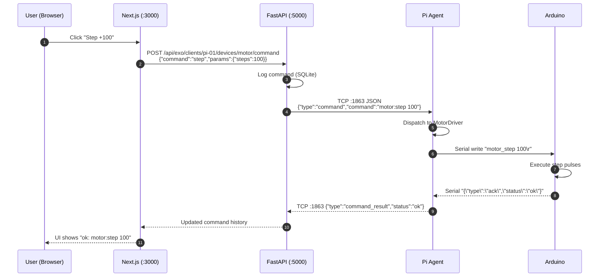
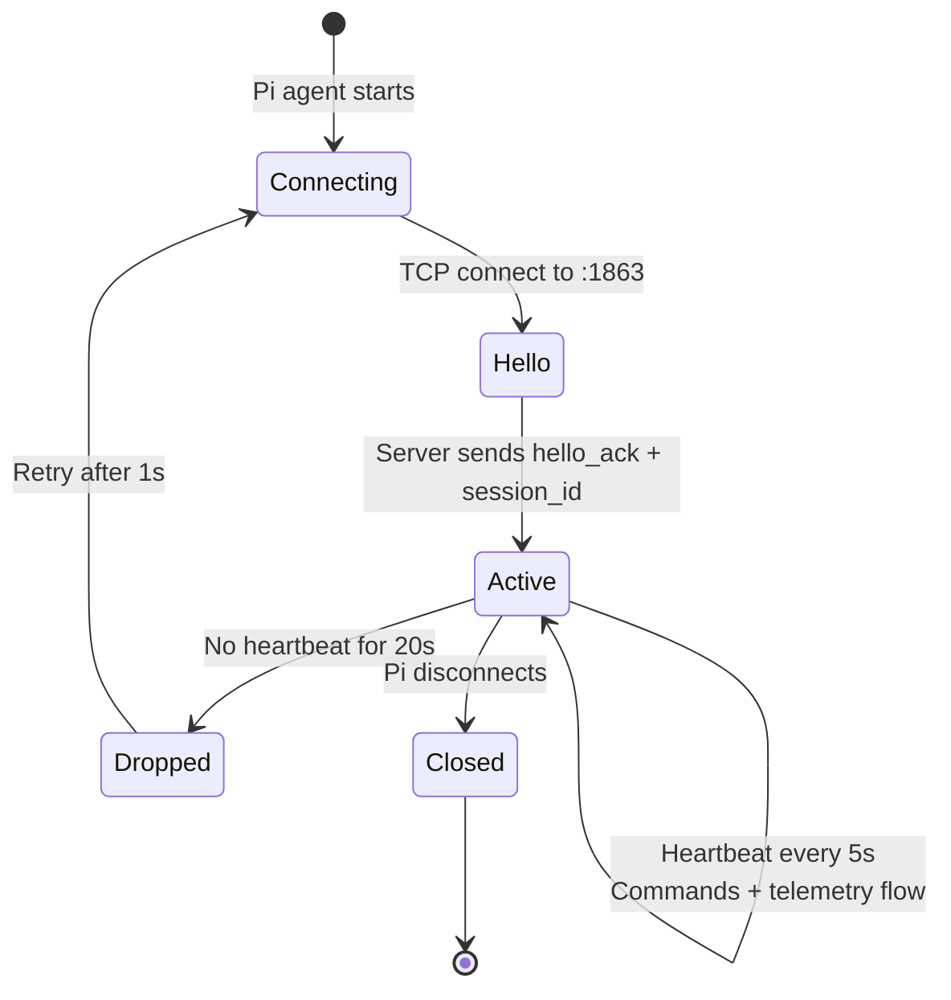

<div align="center">

# Exo-Platform

### Unified Remote Control System for Research Exoskeletons

*A full-stack platform orchestrating fleets of Raspberry Pi-powered exoskeletons from a single web dashboard — with live video, real-time telemetry, multi-device control, and a software simulator.*


[Quick Start](#-quick-start) •
[Architecture](#-architecture) •
[Devices](#-supported-devices) •
[Setup Guides](#-setup-guides) •
[Roadmap](#-roadmap)

</div>

---

## Why This Exists

Built for **Dr. Waqas Khalid's Nanotech Lab at UC Berkeley** in collaboration with **ARM**, this platform addresses a recurring problem in research robotics: you have multiple exoskeletons with multiple devices (cameras, stimulators, sensors, displays) scattered across multiple Raspberry Pis — and no unified way to control, monitor, record, or simulate them.

**Exo-Platform solves this** by providing:

- A **central server** that any number of Pi-based exoskeletons can connect to
- A **web dashboard** for researchers to monitor and control everything in real-time
- A **device abstraction layer** that handles motors, cameras, OLED glasses, temperature sensors, ultrasonic stimulators, vibration motors, gyroscopes, and TENS units
- A **software simulator** for testing without hardware
- **Persistent storage** of all sensor data and commands for later analysis

---

## Features

<table>
<tr>
<td width="50%">

### Multi-Pi Orchestration
Connect unlimited Raspberry Pis to a single server. Each Pi reports its device manifest on connection — the dashboard dynamically adapts.

### Live Video Streaming
MJPEG streams from each Pi's cameras, with support for multiple cameras per Pi (eye tracking + environment).

### Real-Time Telemetry
10Hz sensor updates pushed to the browser via WebSocket. Live graphs for temperature, gyroscope, device state.

### Software Simulator
Run the entire stack with no hardware. Virtual device indicators animate from real telemetry data.

</td>
<td width="50%">

### 8 Device Types Supported
Motor, OLED Glasses, Camera, Temperature, Gyroscope, Ultrasonic Stimulator, Vibration, TENS — all with unified command API.

### JWT Authentication
Researchers log in with credentials. Role-based access (admin, researcher) ready for multi-user deployments.

### SQLite Persistence
Every command, sensor reading, and recording is logged. Zero-config database for local dev; swap to PostgreSQL for production.

### Polished Frontend
Built on Next.js 15 + React 19 + Tailwind + Radix UI. Dark mode, responsive, production-ready.

</td>
</tr>
</table>

---

## Architecture

```
                              ┌──────────────────────────────────┐
                              │    Researcher's Browser          │
                              │    http://localhost:3000         │
                              └─────────────────┬────────────────┘
                                                │
                                                │ HTTP + WebSocket
                                                ▼
                ┌───────────────────────────────────────────────────────────┐
                │                  Next.js Frontend (:3000)                  │
                │  • /portal/exo              → Dashboard                    │
                │  • /portal/exo/client/[id]  → Per-Pi control panel         │
                │  • /portal/exo/simulator    → Software twin visualization  │
                │                                                             │
                │    Proxy rewrite: /api/exo/* → http://localhost:5000/api/* │
                └───────────────────────────┬───────────────────────────────┘
                                            │
                                            ▼
                ┌───────────────────────────────────────────────────────────┐
                │               FastAPI Backend Server (:5000)               │
                │                                                             │
                │    HTTP Routes        WebSocket         SQLite DB           │
                │    /api/clients       /telemetry/ws     (telemetry,         │
                │    /api/commands      /video-stream      commands, users)   │
                │    /api/video         /auth                                 │
                │                                                             │
                │  ┌──────────────────────────────────────────────┐          │
                │  │  ConnectionManager (Multi-Pi orchestration)   │          │
                │  │  • Control channel (TCP :1863 — JSON lines)   │          │
                │  │  • Video channel   (TCP :8612 — JPEG frames)  │          │
                │  │  • Telemetry       (TCP :8613 — sensor data)  │          │
                │  └──────────────────────────────────────────────┘          │
                └───────────────────────────┬───────────────────────────────┘
                                            │
                              TCP (local network or VPN)
                                            │
                ┌───────────────────────────┴───────────────────────────────┐
                ▼                           ▼                                ▼
     ┌──────────────────┐      ┌──────────────────┐           ┌──────────────────┐
     │  Pi Agent #1     │      │  Pi Agent #2     │    ...    │  Pi Agent #N     │
     │  (Exoskeleton A) │      │  (Exoskeleton B) │           │  (Exoskeleton N) │
     │                  │      │                  │           │                  │
     │ Device Drivers:  │      │ Device Drivers:  │           │ Device Drivers:  │
     │  • Motor         │      │  • Motor         │           │  • Camera        │
     │  • OLED Glasses  │      │  • Camera        │           │  • Temperature   │
     │  • Camera        │      │  • Gyroscope     │           │  • TENS          │
     │  • Gyroscope     │      │  • Vibration     │           │  • Ultrasonic    │
     │  • Ultrasonic    │      │  • TENS          │           │                  │
     └────────┬─────────┘      └────────┬─────────┘           └────────┬─────────┘
              │                         │                              │
              │ USB Serial @ 115200     │                              │
              ▼                         ▼                              ▼
     ┌──────────────────┐      ┌──────────────────┐           ┌──────────────────┐
     │  Arduino / Teensy│      │  Arduino / Teensy│           │  Arduino / Teensy│
     │   exo_controller │      │   exo_controller │           │   exo_controller │
     │                  │      │                  │           │                  │
     │  PWM, I2C, GPIO  │      │  PWM, I2C, GPIO  │           │  PWM, I2C, GPIO  │
     └──────────────────┘      └──────────────────┘           └──────────────────┘

     ─────────────────────────────────────────────────────────────────────────────

                              ┌──────────────────────────────┐
                              │  EEG Lab (companion)          │
                              │  Raspberry Pi + Teensy        │
                              │                               │
                              │  10ch EEG @ 250Hz             │
                              │  → FastAPI :8000 + WebSocket  │
                              │  → Plotly live plots           │
                              │  → CSV captures                │
                              └──────────────────────────────┘
```

### Command Lifecycle — Browser to Hardware



### Session Lifecycle



---

## Quick Start

Get from zero to a working demo in **5 minutes** — no hardware needed.

### Prerequisites
- Python 3.10+
- Node.js 20+ with `pnpm` (or `npm`)
- macOS, Linux, or Raspberry Pi OS

### 1. Clone and install

```bash
git clone https://github.com/talhaiijaz/united_exo.git
cd united_exo

# Server dependencies
pip3 install -r server/requirements.txt

# Pi agent dependencies (for simulation)
pip3 install -r pi_agent/requirements.txt

# Frontend dependencies
cd nanotech_website && pnpm install && cd ..
```

### 2. Start three terminals

**Terminal 1 — Backend Server:**
```bash
cd server && python3 app.py
# Server listening on http://0.0.0.0:5000
# Control port: 1863 | Video port: 8612 | Telemetry: 8613
```

**Terminal 2 — Simulated Pi Agent:**
```bash
EXO_SIM_MODE=1 EXO_HOST=127.0.0.1 python3 pi_agent/agent.py
# Connected to server with session_id=...
# Loaded 8 devices: motor, oled, camera, temperature, gyroscope, ultrasonic, vibration, tens
```

**Terminal 3 — Frontend:**
```bash
cd nanotech_website && pnpm dev
# Ready on http://localhost:3000
```

### 3. Open the dashboard

Visit **http://localhost:3000/portal/exo** and you should see:

- Your simulated Pi listed as connected
- Click into it → see live video feed (synthetic)
- Control tab → click any device command, see it execute
- Telemetry tab → live sensor graphs updating at 10Hz
- Simulator page → animated device indicators

---

## Companion Project — EEG Lab

The platform ships with **[eeg_lab/](eeg_lab/)** — a dedicated live EEG visualization and capture system built alongside the exoskeleton stack.

<table>
<tr>
<td width="60%">

**What it is:** A standalone Raspberry Pi web app that reads 10-channel EEG data from a Teensy microcontroller at 250Hz, streams it live via WebSocket to a browser with Plotly plots, applies real-time filters (60Hz notch, 0.5–40Hz bandpass), and saves captures as CSV.

**When to use it:** Neural signal acquisition experiments where you need higher-bandwidth, filter-aware streaming than the general telemetry channel supports.

**How it fits:** Runs on a separate Pi (or alongside an exo agent on the same Pi). Researchers can open both dashboards side by side — Exo-Platform for exoskeleton control, EEG Lab for neural signals.

</td>
<td width="40%">

| Feature | Spec |
|---------|------|
| Channels | 10 |
| Sample rate | 250 Hz |
| Streaming | WebSocket @ 20 Hz frames |
| Filters | Notch 60Hz, BP 0.5–40Hz |
| Captures | CSV, 5/30/60 sec |
| Sessions | 1 controller, N viewers |
| Frontend | Plotly (vanilla JS) |

</td>
</tr>
</table>

See [eeg_lab/README.md](eeg_lab/README.md) for the full setup guide.

---

## Theoretical Simulation Tools

Beyond hardware control, the platform includes **browser-based physics simulators** for theoretical analysis — no backend required, served as static HTML under `nanotech_website/public/simulations/`.

<table>
<tr>
<td width="60%">

### CNT Nanosensor Unified Simulation

A comprehensive theoretical physics simulator for Carbon Nanotube-based nanosensors, contributed by **Tyler Wang**. Models geometry, capacitance, EDL effects, DNA hybridization detection, FMM concentration prediction, nanolaminate dielectrics, and more — with real yeast (*S. cerevisiae*) impedance data.

**Access:**
- Portal: `http://localhost:3000/portal/cnt-simulation`
- Direct: `http://localhost:3000/simulations/cnt-nanosensor.html`

See [nanotech_website/public/simulations/README.md](nanotech_website/public/simulations/README.md) for the full module list (18+ tools including NanoLam, SimRC, FMM/NiTRO, sensitivity analysis, EIS upload).

> **Note:** The repo currently ships with a placeholder at `nanotech_website/public/simulations/cnt-nanosensor.html`. To activate the full simulator, replace it with Tyler's original `simulation_demo (3).html` file. The placeholder page explains this when visited.

</td>
<td width="40%">

| Module | What it computes |
|--------|-----------------|
| CNT/NS Geometry | SA, # CNTs/NS, pairs/chip |
| Capacitance | Cylindrical coaxial, parallel-plate |
| EDL | Debye length, cosh correction |
| DNA Detection | ΔC, ΔZ, Δi binding signal |
| SimRC v1.0 | RC waveforms, DFT Z-extraction |
| NanoLam | Maxwell-Wagner multilayer κ |
| FMM (NiTRO) | Inverse concentration prediction |

</td>
</tr>
</table>

---

## Where Is Everything?

This repo has a lot of pieces. **See [STRUCTURE.md](STRUCTURE.md) for a complete visual map** of every directory and what it's for — including which docs to read for what task.

---

## Repository Structure

```
exo-platform/
│
├── server/                         Python FastAPI backend
│   ├── app.py                      Main server entrypoint
│   ├── config.py                   Environment-driven config
│   ├── db.py                       SQLite schema + operations
│   ├── comm/                       Pi connection management
│   │   ├── manager.py              Multi-client TCP orchestrator
│   │   └── __init__.py
│   ├── routes/                     HTTP endpoints
│   │   ├── clients.py              Pi listing
│   │   ├── commands.py             Command dispatch
│   │   ├── video.py                MJPEG streaming
│   │   ├── telemetry.py            Sensor data (REST + WebSocket)
│   │   └── auth.py                 JWT login
│   └── auth/                       Password hashing + JWT tokens
│
├── pi_agent/                       Runs on each Raspberry Pi
│   ├── agent.py                    Main agent (session lifecycle)
│   ├── config.py                   Environment-driven config
│   ├── telemetry.py                Sensor data streaming thread
│   ├── devices.json                Device manifest (editable per Pi)
│   └── devices/                    Pluggable device drivers
│       ├── base.py                 DeviceDriver abstract class
│       ├── motor.py                Stepper/servo motor control
│       ├── oled.py                 OLED display (glasses)
│       ├── camera.py               Pi Camera + USB cameras
│       ├── temperature.py          Temperature sensor + control
│       ├── gyroscope.py            IMU (6-axis accel + gyro)
│       ├── ultrasonic.py           Ultrasonic stimulator
│       ├── vibration.py            Vibration motor (haptic)
│       └── tens.py                 TENS unit (with safety timer)
│
├── arduino/                        Microcontroller firmware
│   └── exo_controller/
│       └── exo_controller.ino      Unified firmware for all devices
│
├── nanotech_website/               Next.js frontend (modified)
│   ├── app/portal/exo/
│   │   ├── page.tsx                Dashboard — lists connected Pis
│   │   ├── client/[clientId]/      Per-Pi control panel
│   │   └── simulator/              Software twin visualization
│   ├── app/portal/cnt-simulation/  CNT theoretical simulator (iframe loader)
│   ├── components/exo/             Exo-specific UI components
│   ├── lib/exo/api.ts              Typed API client
│   ├── public/simulations/         Standalone HTML physics simulators
│   │   ├── README.md               Index of available simulations
│   │   └── cnt-nanosensor.html     CNT Unified Simulation (Tyler Wang)
│   └── next.config.mjs             Proxy rewrite to backend
│
├── eeg_lab/                        EEG acquisition companion app
│   ├── backend/                    FastAPI + WebSocket server
│   │   ├── main.py                 Entry point
│   │   ├── api/                    REST + WebSocket routes
│   │   ├── devices/                Teensy serial manager
│   │   ├── processing/             Filters + FFT + ring buffer
│   │   ├── sessions/               Controller/viewer lock
│   │   └── storage/                CSV capture manager
│   ├── frontend/                   Vanilla JS + Plotly UI
│   ├── eeg_teensy/                 Teensy firmware (.ino)
│   ├── hardware/                   Physical accessories (3D models, STL)
│   │   ├── README.md               Cable cutting jig + routing guide
│   │   └── cable-cutting-jig.stl   3D printable jig (by Yuxiang Tian)
│   ├── deploy/                     systemd, nginx, udev rules
│   └── config.yaml                 Sample rate, channels, port
│
├── scripts/
│   ├── start_server.sh             One-command server startup
│   ├── deploy_pi.sh                SCP agent to Pi + install
│   └── setup_pi.sh                 Fresh Pi OS preparation
│
├── docs/                           Diagrams + screenshots
│
├── README.md                       You are here
├── ARCHITECTURE.md                 Deep architecture dive
├── CONTRIBUTING.md                 How to add device drivers
├── DEPLOYMENT.md                   Production deployment
└── LICENSE                         MIT
```

---

## Supported Devices

| Device | Icon | Commands | Telemetry | Example Use |
|--------|:----:|----------|-----------|-------------|
| **Motor** | M | `step N` · `speed N` · `home` · `stop` | Step count, speed | Joint actuation, linear stage |
| **OLED Glasses** | O | `display I MSG` · `clear` · `dot X Y` · `blank` | Display state | Eye-tracking targets, HUD |
| **Camera** | C | `start` · `stop` · `snapshot` · `record_start/stop` | Frame count, FPS | Eye tracking, environment |
| **Temperature** | T | `read` · `set_target N` · `control on/off` | Temp °C, target | Limb/environment thermal regulation |
| **Gyroscope (IMU)** | G | `read` · `calibrate` | 6-axis accel + gyro | Orientation, fall detection |
| **Ultrasonic** | U | `pulse F D` · `set_frequency F` · `stop` | Active, frequency | Neuromodulation |
| **Vibration** | V | `set N` · `pattern P` · `stop` | Intensity, pattern | Haptic feedback, muscle activation |
| **TENS** | E | `set I F D` · `pattern P` · `stop` | Intensity, frequency, active | Muscle stimulation (with auto-stop safety) |

**Want to add a device?** See [CONTRIBUTING.md](CONTRIBUTING.md).

---

## Setup Guides

The project is split into clear per-component guides. Follow them in order:

| Step | Component | Guide | What You'll Do |
|------|-----------|-------|----------------|
| 1 | **Server** | [server/README.md](server/README.md) | Set up FastAPI backend on laptop or server |
| 2 | **Raspberry Pi** | [pi_agent/README.md](pi_agent/README.md) | Prepare Pi OS, deploy agent, configure devices |
| 3 | **Devices** | [pi_agent/DEVICES.md](pi_agent/DEVICES.md) | Wire up motors, sensors, stimulators to the Pi |
| 4 | **Arduino** | [arduino/README.md](arduino/README.md) + [arduino/WIRING.md](arduino/WIRING.md) | Flash firmware, wire circuit |
| 5 | **Frontend** | [nanotech_website/EXO_README.md](nanotech_website/EXO_README.md) | Customize dashboard, add new device visualizations |
| 6 | **EEG Lab** (optional) | [eeg_lab/README.md](eeg_lab/README.md) | Set up EEG acquisition on a dedicated Pi |
| 7 | **Deployment** | [DEPLOYMENT.md](DEPLOYMENT.md) | Docker, reverse proxy, HTTPS, multi-tenant |

---

## Tech Stack

<table>
<tr>
<th>Layer</th>
<th>Technology</th>
<th>Why</th>
</tr>
<tr>
<td rowspan="3"><b>Backend</b></td>
<td>Python 3.10+ / FastAPI</td>
<td>Native async, auto OpenAPI docs, WebSocket support, Pydantic validation</td>
</tr>
<tr>
<td>SQLite + aiosqlite</td>
<td>Zero-config for local dev; scales to PostgreSQL trivially</td>
</tr>
<tr>
<td>Custom TCP protocol</td>
<td>Low-latency Pi-server link; survives WiFi blips with heartbeat</td>
</tr>
<tr>
<td rowspan="4"><b>Frontend</b></td>
<td>Next.js 15 / React 19</td>
<td>App Router, Server Components, API proxy, fast dev feedback</td>
</tr>
<tr>
<td>Tailwind CSS 4</td>
<td>Consistent design system, dark mode, small bundle</td>
</tr>
<tr>
<td>Radix UI</td>
<td>Accessible components, keyboard navigation</td>
</tr>
<tr>
<td>Recharts</td>
<td>Real-time sensor graphs</td>
</tr>
<tr>
<td rowspan="3"><b>Pi Agent</b></td>
<td>Python 3.10+</td>
<td>Runs on all Pi models, same codebase as server</td>
</tr>
<tr>
<td>Picamera2</td>
<td>Native CSI camera support on Pi OS Bookworm</td>
</tr>
<tr>
<td>PySerial</td>
<td>USB serial to Arduino with `/dev/tty*` auto-detection</td>
</tr>
<tr>
<td rowspan="2"><b>Firmware</b></td>
<td>Arduino / Teensy / ESP32</td>
<td>Any microcontroller with Serial + I2C + PWM works</td>
</tr>
<tr>
<td>Compile-time device flags</td>
<td>Single firmware for all hardware configurations</td>
</tr>
</table>

---

## Security Notes

> **Before deploying publicly**, rotate these defaults:

- **Default admin password** — Set via `EXO_ADMIN_PASSWORD` env var, or change immediately after first login
- **JWT secret** — Set `EXO_JWT_SECRET` to a random string (e.g., `openssl rand -hex 32`)
- **CORS origins** — Restrict `EXO_CORS_ORIGINS` to your frontend domain(s)
- **Bind address** — In production, bind to `127.0.0.1` and use a reverse proxy (Caddy/Nginx) with HTTPS

See [DEPLOYMENT.md](DEPLOYMENT.md) for hardening recommendations.

---

## Screenshots

> Add screenshots here after running locally. Suggestions:
> - Dashboard showing 3 connected Pis
> - Per-client page with live video + device controls
> - Simulator page with animated device indicators
> - Telemetry graph showing gyroscope readings over time

Place images in `docs/screenshots/` and reference them here.

---

## Roadmap

- [x] Multi-Pi connection management with heartbeat
- [x] Live MJPEG video streaming
- [x] Real-time telemetry via WebSocket
- [x] 8 device drivers with unified command API
- [x] Software simulator with animated indicators
- [x] JWT authentication
- [x] SQLite persistence
- [x] Unified Arduino firmware with compile-time flags
- [x] Docker Compose setup
- [ ] Video recording to MP4 (frames persisted; MP4 encoder pending)
- [ ] Multi-camera support per Pi
- [ ] Eye tracking pipeline (cv2 + tracking overlay)
- [ ] TENS safety interlocks (physical e-stop integration)
- [ ] Experiment scripting (Python/YAML-based automation)
- [ ] PostgreSQL + TimescaleDB for production telemetry
- [ ] Mobile companion app (React Native)
- [ ] Multi-tenant researcher workspaces

---

## Contributing

Pull requests welcome. See [CONTRIBUTING.md](CONTRIBUTING.md) for:
- How to add a new device driver (15-minute walkthrough)
- Code style (ruff + Python typing, ESLint + TypeScript strict)
- PR checklist

---

## Acknowledgments

- **Dr. Waqas Khalid** — Principal Investigator, Nanotech Lab, UC Berkeley
- **ARM** — Collaboration partner driving the working prototype requirement
- **Tyler Wang** — CNT Nanosensor theoretical simulation (public/simulations/cnt-nanosensor.html)
- **Yuxiang Tian** — EEG electrode cable cutting jig (eeg_lab/hardware/)
- **Marco** — Server infrastructure setup
- **Nanotech Lab researchers** — Feature requests, hardware testing, domain knowledge
- Built on the foundation of [Exoskeleton_public](./Exoskeleton_public) (session-based TCP protocol) and [nanotech_website](./nanotech_website) (research portal UI)

---

## License

MIT — see [LICENSE](LICENSE).

<div align="center">

**Built with care for open research.**

*Questions? Open an issue or reach out to the Nanotech Lab at UC Berkeley.*

</div>
